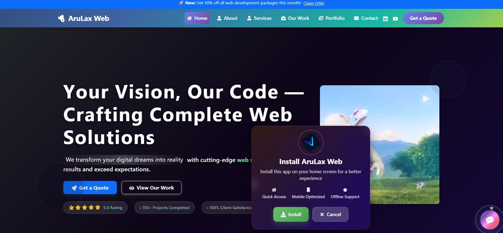
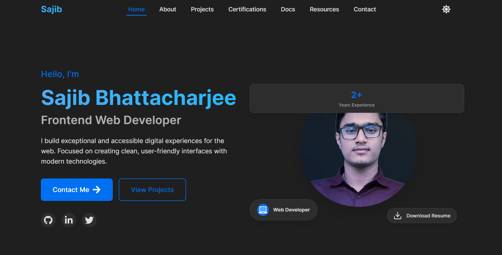
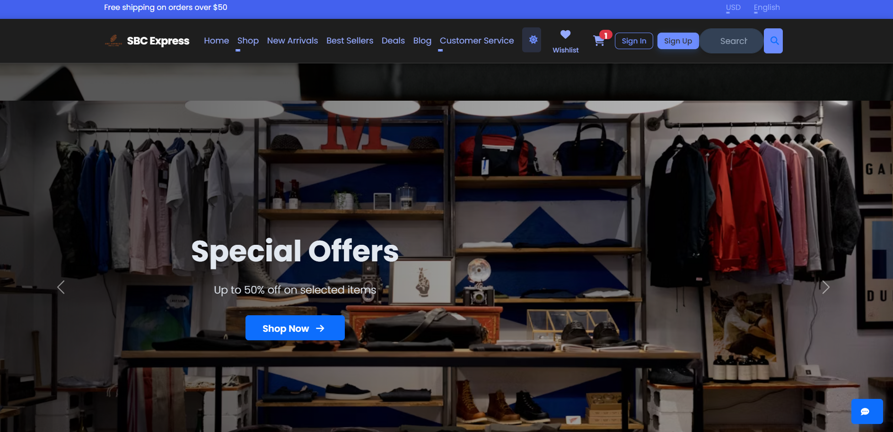
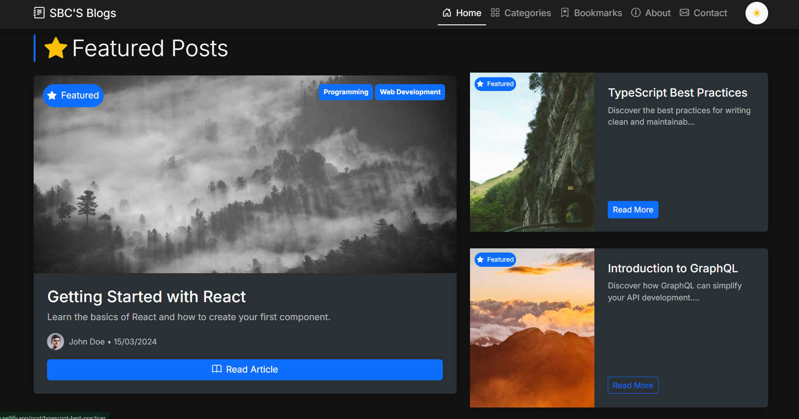
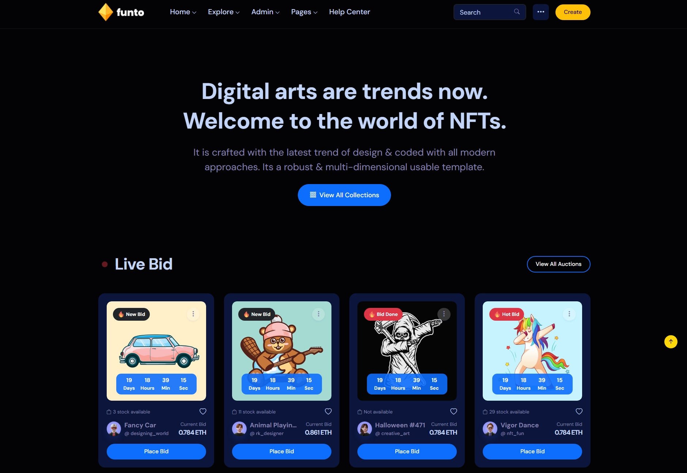
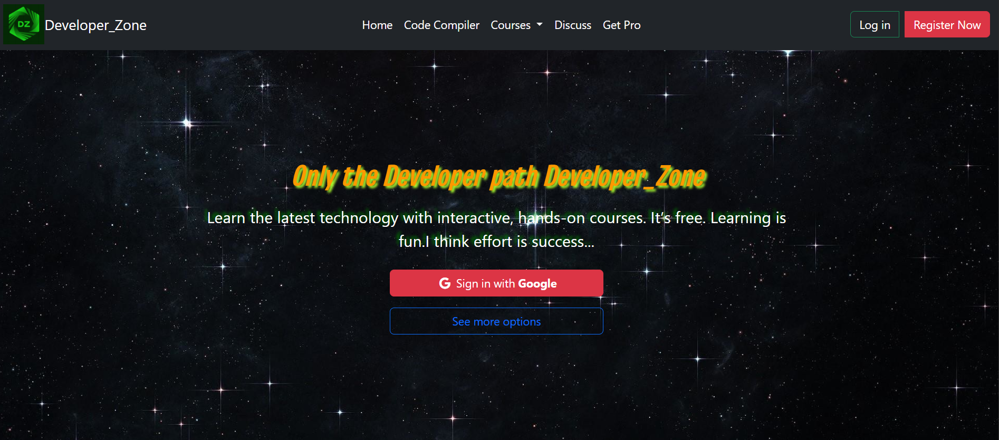
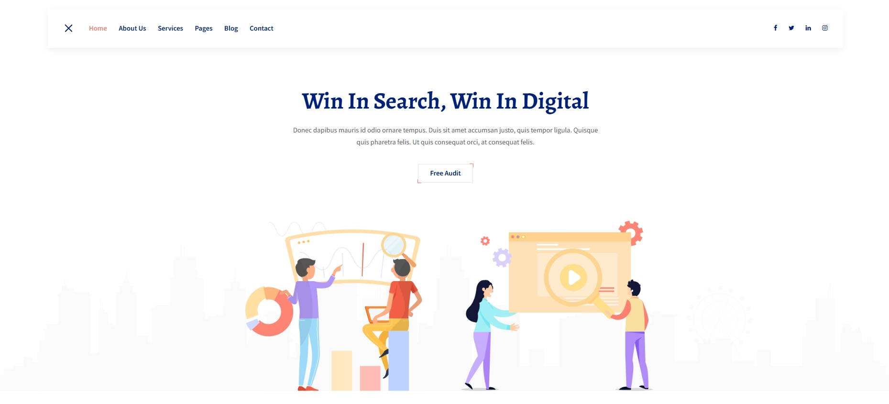

<!-- Hero Section -->
<h1 align="center">
  
  Hi, I'm Sajib Bhattacharjee 👨‍💻 
</h1>
<h3 align="center">🌐 Front-End Web Developer | UI/UX Enthusiast | Open Source Advocate</h3>

<b>🚀 Crafting responsive, scalable, and delightful UIs with passion and precision</b>

<!-- Typing Animation -->

  

<!-- Profile Image -->

  

<!-- Social Badges -->

  
  
  
  <!-- Remove or update Twitter if not used -->

---

## 📖 Table of Contents

- [👨‍💻 About Me](#about-me)
- [🛠️ Tech Stack](#-tech-stack)
- [🧰 Tools & IDEs](#-tools--ides)
- [📂 Pinned Projects](#-pinned-projects)
- [🎯 Current Goals](#-current-goals)
- [🎓 Educational Background](#-educational-background)
- [🌐 Languages Spoken](#-languages-spoken)
- [🎯 Hobbies & Interests](#-hobbies--interests)
- [📈 GitHub Stats](#-github-stats)
- [📫 Contact](#-contact)
- [🛡️ Credits](#-credits)

---

## 👨‍💻 About Me

I'm Sajib Bhattacharjee, a passionate Front-End Web Developer with a keen eye for UI/UX and a love for open source. I specialize in building modern, responsive, and accessible web applications using the latest technologies. Always eager to learn and contribute to the developer community.

---

## 🛠️ Tech Stack

### 🧠 Programming Languages

     

### 🎨 Front-End Development

    

### 🛠️ Developer Tools & Platforms

  

### ⚙️ Back-End Development

   

---

## 🧰 Tools & IDEs

  
Show tools & environments

|                                                               IDE/Editor                                                                |      Browsers      |  API/Testing   |  Deployment  |   Cloud/DB    |                                                    Productivity                                                     |
| :-------------------------------------------------------------------------------------------------------------------------------------: | :----------------: | :------------: | :----------: | :-----------: | :-----------------------------------------------------------------------------------------------------------------: |
|         VSCode        | 🌐 Chrome DevTools |   🧪 Postman   |  🚀 Netlify  |   🐬 MySQL    |  Notion |
|     WebStorm    |     🦊 Firefox     | Thunder Client |    Vercel    | MongoDB Atlas |  Trello |
|  CodeSandbox |                    |                | GitHub Pages |  PostgreSQL   |    Slack   |

---

## 📂 Pinned Projects

  
See my top projects

  - **[Web Agency](https://github.com/Sajib-Bhattacharjee/arulaxweb)**  
  🎨 AruLaxWeb - AI-Powered Web Development Agency Website💎     
  🚀 React.js, TypeScript, Redux, Framer Motion  
  🔗 [Live Site](https://arulaxweb.netlify.app/)  
  
  
- **[Awesome Portfolio](https://github.com/Sajib-Bhattacharjee/sajib-bhattacharjee-portfolio)**  
  📝 A modern, responsive developer portfolio template.  
  🚀 React, Redux, Framer Motion  
  🔗 [Live Site](https://sajib-bhattacharjee.netlify.app/)  
  

- **[E-Commerce App](https://github.com/Sajib-Bhattacharjee/react-ecommerce-frontend)**  
  📝 Full-featured e-commerce web app with cart, auth, and payments.  
  🚀 React, Redux, Typescript, Bootstrap  
  🔗 [Live Site](https://sbcexpress.netlify.app/)  
  

- **[Blog Platform](https://github.com/Sajib-Bhattacharjee/blog-website-2025)**  
  📝 Minimal blog platform with markdown support.  
  🚀 React.js, Redux.js, Typescript, Bootstrap  
  🔗 [Live Site](https://sbcblog.netlify.app/)  
  

- **[NFT-Marketplace](https://github.com/Sajib-Bhattacharjee/sbc-funto-website-09)**  
  🎨 Funto - Modern NFT Marketplace built with Next.js 14 & React. Discover, buy, sell & trade digital assets!💎     
  🚀 Next.js, TypeScript, Redux, Framer Motion  
  🔗 [Live Site](https://sbcfunto.netlify.app/)  
  

- **[E-Learning Platform](https://github.com/Sajib-Bhattacharjee/e-learning-platform)**  
  📝 A responsive Education Website.  
  🚀 Bootstrap, JavaScript  
  🔗 [Live Site](https://developerzone2025.netlify.app/)  
  

  - **[SeoBiz-Digital Experiences](https://github.com/Sajib-Bhattacharjee/sbc-seobiz-01)**  
  📝 Complete Web Experience with SeoBiz.  
  🚀 Bootstrap, SASS, JavaScript, Animation 
  🔗 [Live Site](https://sbcseobiz.netlify.app/)  
  

---

## 🎯 Current Goals

  
Expand to see my goals

- Mastering TypeScript and Next.js
- Building a SaaS dashboard template
- Contributing to open source projects
- Learning advanced animations with Framer Motion
- Exploring AI integrations in web apps 🤖
- Building a personal design system
- Growing my developer community
- Writing more technical articles
- Improving web accessibility (a11y)
- Learning about WebAssembly and Rust

---

## 🎓 Educational Background

  
Expand to see education

- **B.Sc. in Computer Science & Engineering**  
  🏛️ North Western University, Khulna, Bangladesh

- **Intermediate of Science (I.Sc.)**  
  🏫 Lohagora Ideal Government College, Lohagora, Narail

- **Secondary School Certificate (SSC)**  
  🏫 Charbhatpara High School, Kashinai, Gopalganj

---

## 🌐 Languages Spoken

- 🇧🇩 **Bangla** – Native Speaker
- 🏴 **English** – Intermediate Proficiency
- 🇮🇳 **Hindi** – Conversational Level

---

## 🎯 Hobbies & Interests

- 🏏 Cricket, ⚽ Football, 🏸 Badminton, ♟️ Chess, 🏐 Volleyball
- 🏊‍♂️ Swimming, 🏃‍♂️ Running, 🚶‍♂️ Walking
- ✈️ Traveling & Exploring New Places

---

## 📈 GitHub Stats

### Most Used Languages

### GitHub Stats

### GitHub Metrics

### GitHub Streak Stats

---

## 📫 Contact

- 🌐 [Portfolio & Projects](https://sajibbhattacharjee.netlify.app)
- 💼 [LinkedIn](https://www.linkedin.com/in/sajib-bhattacharjee-42682a178/)
- 📧 [Email Me](mailto:sajibbhattacharjee2000@gmail.com)

---

## 🛡️ Credits

**All rights reserved by Sajib Bhattacharjee © 2025**  
**Created with ❤️ by Sajib Bhattacharjee**  
**Dedicated to "Sir! Anisul Islam"**

> 🙏 _Thanks a lot for visiting!_

  <a href="#top">🔝 Back to top</a>

